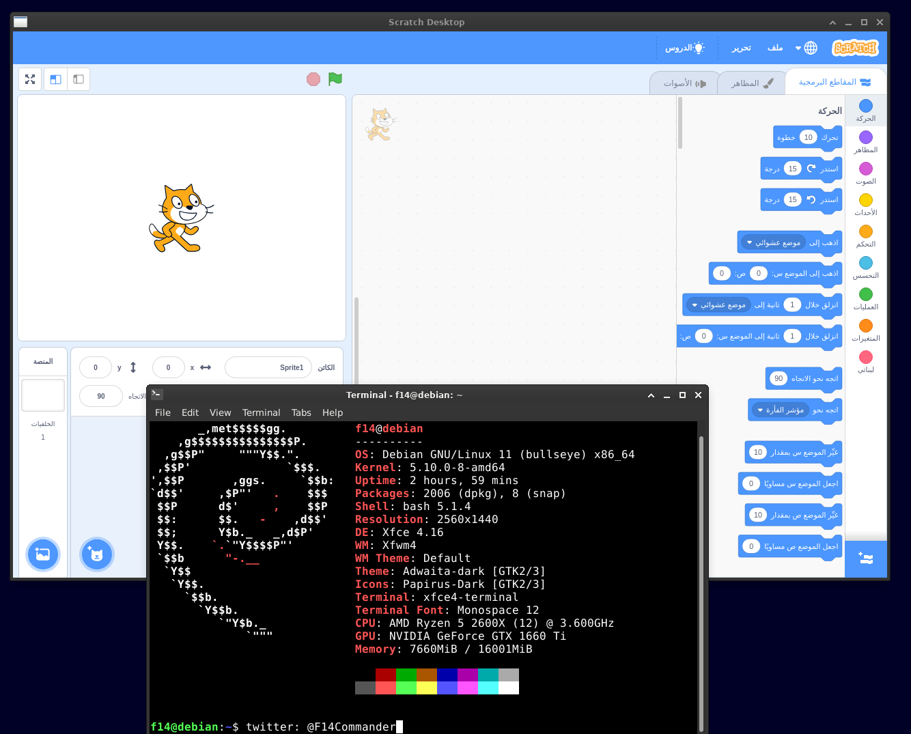

# محرر المكعبات سكراتش 3.0
نسخه غير متصله بالإنترنت من محرر المكعبات سكراتش.

## التنزيل
https://github.com/redshaderobotics/scratch3.0-linux/releases اضغط على الرابط
وحمل الصيغة المدعومة من نظامك.
### للتوزيعات الأخرى
#### وبيشتغل معك المحرر "./scratch-desktop" حمل النسخه المضغوطه من البرنامج وفك الضغط ونفذ امر 

## توزيعات تدعم البرنامج/التوزيعات المجربه
* Ubuntu 18.04.2
* Debian 11.10.9.8
* Linux Mint 19.1
* Fedora 30
* OpenSUSE Leap 15.0
* Ubuntu 14.04 (32 bit)

## "Debian 11" صورة من

## "Ubuntu 18.04.2" صورة من

## "Linux Mint 19.1" صورة من

## "Fedora 30" صورة من

<a href="https://twitter.com/F14Commander">ترجمه: سليمان المهوس</a>
### License
BSD Clause 2 provided by the LLK

### Credit
We are very thankful for the work initiated by the github user @lyshie. Through his idea we started working on this release
of this linux version. His script and description is at https://gist.github.com/lyshie/0c49393076b8b375ca1bd98c28f95fb0
